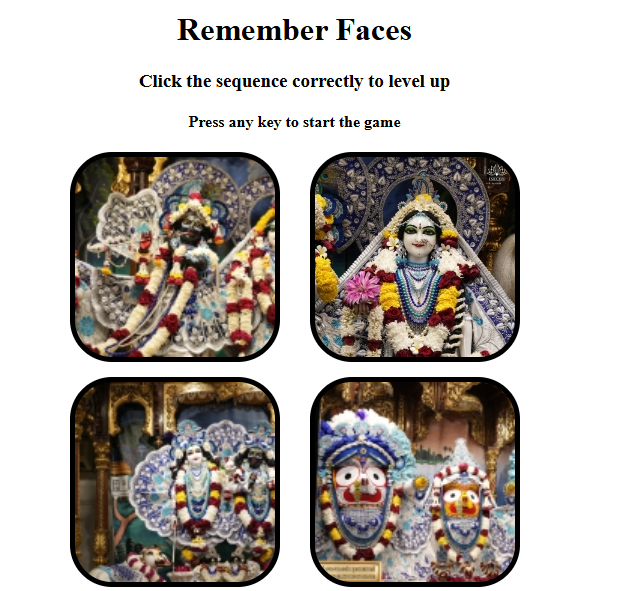

# 🧠 Simon Says Game

A fun and interactive memory game inspired by the classic "Simon Says"! Test your memory by following an ever-growing sequence of faces. Built with HTML, CSS, and JavaScript.

---

## 📸 Demo

---

## 🛠️ Technologies Used

- HTML
- CSS
- JavaScript

---

## 🎮 How to Play

1. Click the **Start** button to begin the game.
2. Watch the color sequence closely as it plays.
3. Repeat the sequence by clicking the color buttons in the same order.
4. The sequence grows by one color each round.
5. Make a mistake, and the game ends.
6. Try to beat your high score!

---

## 📂 Project Structure

RememberFaces |---index.html |---style.css|----app.js
